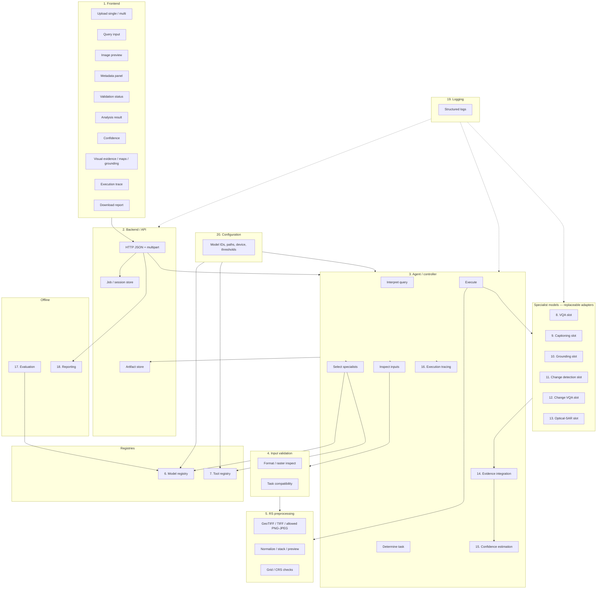
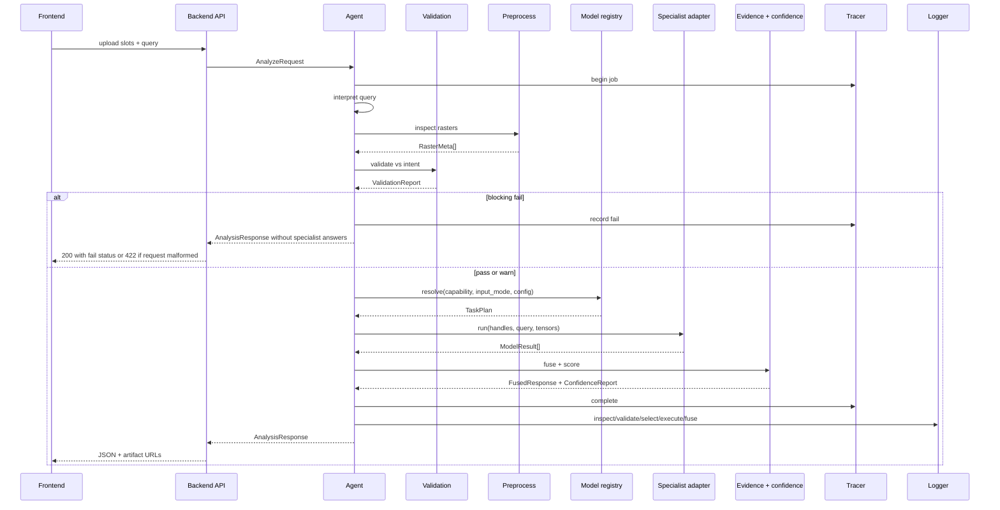
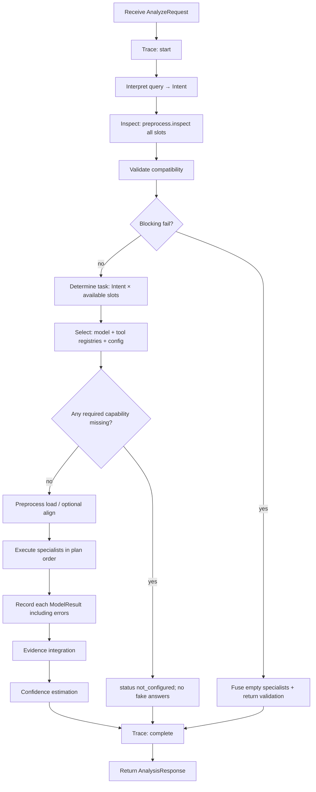
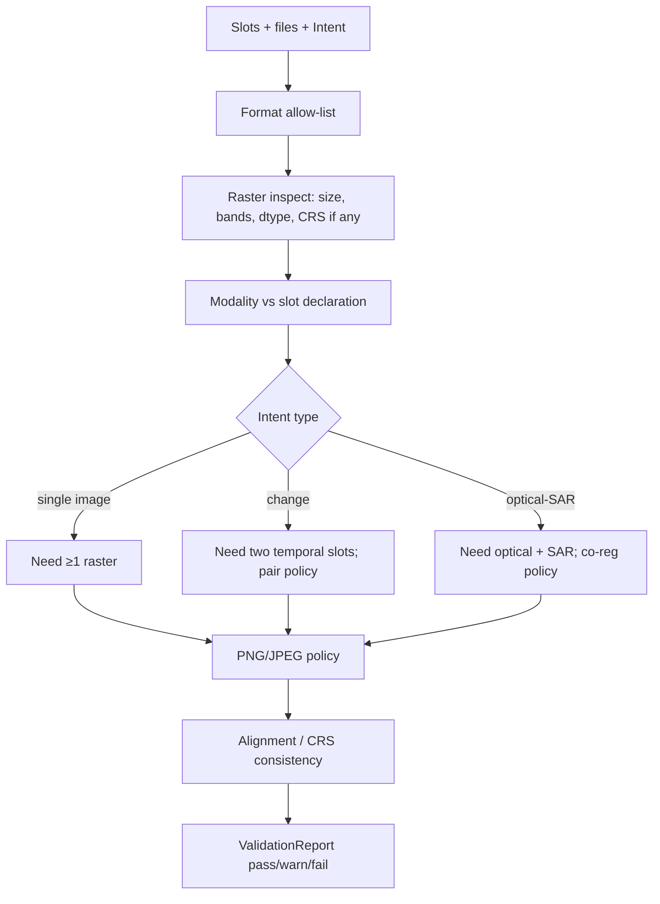
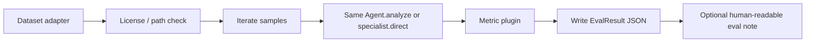
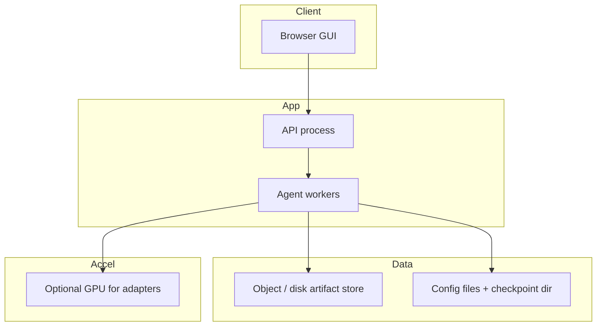

# SatQuery AI — Architecture

| Field | Value |
| --- | --- |
| Product | SatQuery AI |
| Problem statement | 26167 |
| Companion document | `PROJECT_SPEC.md` |
| Status | Architecture only — no application code |
| Date | 2026-09-04 |

This document defines a production-quality, modular architecture. Specialist **implementations are replaceable**. Where a concrete checkpoint or paper model has not been selected, this document uses **capability IDs** and **adapter slots**, not invented product names presented as deployed models.

---

## 1. Goals and constraints

**Goals**

- Interactive GUI/web client talking only to a backend API.
- Agentic controller that inspects inputs, validates compatibility, selects specialists from registries, executes them, fuses evidence, estimates confidence from run signals, and emits an observable trace.
- Perception and RS semantics from specialist models/tools, not a generic LLM/VLM as the sole stack.
- Honest metadata, confidence, maps, and evaluation metrics.

**Constraints (from spec)**

- Input modes I1–I4; formats GeoTIFF/TIFF required; PNG/JPEG only for permitted benchmark assets.
- Capabilities M1–M6 and GUI surfaces in spec §8.
- Layer split: UI / Agent / Models / Tools / Configuration.
- Type hints, tests, logging, error handling, reproducibility at implementation time.

---

## 2. Logical architecture

Twenty named components map onto five layers. Registries and configuration sit beside the agent so selection is not hardcoded in the UI.

### 2.1 Component map

| # | Component | Layer | Package (logical) |
| --- | --- | --- | --- |
| 1 | Frontend | UI | `frontend` |
| 2 | Backend/API | API | `api` |
| 3 | Agent/controller | Agent | `agent` |
| 4 | Input validation | Agent + Tools | `validation` |
| 5 | Remote-sensing preprocessing | Tools | `preprocess` |
| 6 | Model registry | Configuration + Models | `registry.models` |
| 7 | Tool registry | Configuration + Tools | `registry.tools` |
| 8 | VQA model | Models | `models.vqa` |
| 9 | Captioning model | Models | `models.caption` |
| 10 | Grounding model | Models | `models.grounding` |
| 11 | Change detection model | Models | `models.change_detect` |
| 12 | Change VQA model | Models | `models.change_vqa` |
| 13 | Optical–SAR analysis | Models + Tools | `models.optical_sar` |
| 14 | Evidence integration | Agent | `agent.evidence` |
| 15 | Confidence estimation | Agent | `agent.confidence` |
| 16 | Execution tracing | Agent | `agent.trace` |
| 17 | Evaluation | Offline / batch | `eval` |
| 18 | Reporting | Tools + API | `report` |
| 19 | Logging | Cross-cutting | `logging` |
| 20 | Configuration | Configuration | `config` |

**RS adaptation (spec M1)** is not a twenty-first runtime box: it is a **training/adaptation pipeline** that produces a checkpoint consumed by at least one production specialist (typically land-cover / VQA / caption encoder). The adapted checkpoint is registered like any other model.

### 2.2 Architecture diagram



---

## 3. Data flow

### 3.1 Interactive analysis (happy path)

1. User assigns files to **slots** (optical, SAR, t0, t1) and enters a query.
2. Frontend `POST`s a session: files + slot map + query text. API persists blobs and returns `session_id`.
3. Frontend `POST /analyze` (or equivalent). API creates a job and invokes the agent.
4. Agent **interprets** the query into intent tags (see §6).
5. Agent **inspects** files via preprocessing: format, bands, size, CRS/transform if present, user-declared modality/date.
6. **Validation** emits `pass` / `warn` / `fail` (never invents missing CRS or dates).
7. If fail for the required task, agent stops specialists, still returns metadata + validation + trace.
8. If pass/warn, agent **selects** model and tool IDs from registries using config + capability tags + input mode.
9. Preprocessing produces tensors/arrays and preview rasters **derived from the files**.
10. Selected specialists run; each returns typed `ModelResult` (text and/or spatial artifacts + **run-derived** scores if the model provides them).
11. **Evidence integration** aligns spatial outputs to a common grid when possible; attaches overlays to slot IDs.
12. **Confidence estimation** combines only signals that exist for this run (model scores, agreement, validation severity). Missing signals reduce confidence or mark `confidence_unavailable` with reason — never a hardcoded default presented as a model score.
13. **Trace** records each step with timestamps, selected IDs, errors, artifact URIs.
14. API returns analysis payload. Frontend renders all spec GUI surfaces.
15. User may `GET` a downloadable report assembled from the same payload + artifact files.

### 3.2 Canonical payload (logical, not code)

Shared types used across API, agent, models, and report:

| Type | Role |
| --- | --- |
| `ImageHandle` | `slot_id`, storage URI, declared modality, optional datetime, original filename |
| `RasterMeta` | format, width, height, band count, dtype, CRS, transform, nodata — **omitted fields are absent, not faked** |
| `ValidationReport` | overall status, per-check codes, messages, blocking vs warning |
| `Intent` | capability tags + optional entity phrases (e.g. “water body”) |
| `TaskPlan` | ordered list of `{kind: model\|tool, registry_id, capability}` |
| `Artifact` | kind (`preview`, `overlay`, `change_map`, `mask`, `boxes`, `report`), URI, source component, CRS/grid ref if known |
| `ModelResult` | `registry_id`, capability, optional text, optional artifacts, optional `raw_scores`, `status`, error if any |
| `FusedResponse` | answer text, artifacts, per-claim evidence links |
| `ConfidenceReport` | scalar and/or per-claim scores, **method id**, input signals used, gaps |
| `TraceEvent` | step name, status, detail, timestamps, child events |
| `AnalysisResponse` | session/job ids, raster metas, validation, fused response, confidence, trace, config snapshot (ids/paths hashes, not secrets) |

### 3.3 Sequence (analyze)



---

## 4. Component responsibilities and interfaces

All public surfaces are **typed** at implementation. Below, “interface” means a contract, not a language binding.

### 4.1 Frontend (1)

**Responsibility:** Render spec §8 surfaces. Map files to slots. No model inference, no fake metadata.

**Talks to:** Backend/API only.

**Outbound**

- `upload(files, slot_map) -> session`
- `analyze(session_id, query, options) -> job`
- `poll/get analysis`, `get artifact`, `download report`

**Inbound display:** `RasterMeta`, `ValidationReport`, answer, `ConfidenceReport`, artifact URLs (preview, overlays, change maps, grounding), `TraceEvent[]`.

**Does not:** load weights, choose registry IDs except optional advanced override later (default: server config).

### 4.2 Backend/API (2)

**Responsibility:** Auth/session (as needed), multipart I/O, job lifecycle, artifact serving, mapping HTTP errors to validation vs infrastructure failures, triggering report export.

**Interfaces**

| Endpoint (logical) | Purpose |
| --- | --- |
| `POST /sessions` | Create session, store uploads |
| `GET /sessions/{id}` | Slot list + stored metas |
| `POST /sessions/{id}/analyze` | Run agent |
| `GET /jobs/{id}` | Status + result |
| `GET /artifacts/{id}` | Bytes (preview, map, overlay) |
| `GET /jobs/{id}/report` | Downloadable report |
| `GET /health` | Liveness; optional GPU/config presence **without inventing model quality** |

API depends on Agent, Reporting, Logging, Configuration. It does **not** import specialist architectures.

### 4.3 Agent/controller (3)

**Responsibility:** Spec §7 orchestration. Sole composer of `TaskPlan`. Calls validation, preprocess, registries, evidence, confidence, tracer.

**Interface**

- `analyze(request: AnalyzeRequest) -> AnalysisResponse`

**Internal ports (injected):** `QueryInterpreter`, `Validator`, `Preprocessor`, `ModelRegistry`, `ToolRegistry`, `EvidenceIntegrator`, `ConfidenceEstimator`, `Tracer`, `Logger`.

Generic LLM, if present, may implement **only** `QueryInterpreter` and/or report wording. It must not be the only `Model` for VQA, change, or optical–SAR.

### 4.4 Input validation (4)

**Responsibility:** Compatibility of slots + intent + raster facts.

**Interface**

- `validate(metas: RasterMeta[], slots: SlotAssignment[], intent: Intent) -> ValidationReport`

**Checks (minimum)**

| Check | Fail vs warn |
| --- | --- |
| Unsupported format | fail |
| PNG/JPEG used outside permitted benchmark/preview policy | fail or warn per config policy |
| Missing required slot for intent (e.g. change without two dates) | fail |
| Optical–SAR intent without both modalities | fail |
| Declared co-registration vs grid/CRS mismatch | fail or warn (see unresolved decisions) |
| Missing CRS when change map / geospatial overlay requested | warn or fail per task need |
| Size/band mismatch for pair tools | fail if tools require equality; else warn |
| Missing acquisition dates for temporal questions | warn; change VQA may still run if user insists and policy allows |

Validation **never** fills CRS, dates, or band semantics with placeholders.

### 4.5 Remote-sensing preprocessing (5)

**Responsibility:** Read rasters, extract true metadata, build model-ready arrays, generate **honest** previews (percentile stretch of real bands, documented), optional resampling **after** validation when tools require a shared grid.

**Interface**

- `inspect(uri) -> RasterMeta`
- `load(uri, spec: LoadSpec) -> RasterTensor` (bands, scale, clip documented in config)
- `preview(uri) -> Artifact` (preview kind)
- `align_pair(a, b, policy) -> AlignResult` (success, residual, or explicit inability)

Tools used here are registered in the tool registry (readers, resamplers, preview renderer).

### 4.6 Model registry (6)

**Responsibility:** Map `(capability, input_mode, constraints)` to a **registered adapter ID** using configuration (enabled list, priority, device, max memory).

**Interface**

- `register(spec: ModelSpec)`
- `resolve(capability, context) -> ModelAdapter` or error `no_compatible_model`
- `list_enabled() -> ModelSpec[]`

`ModelSpec` fields: `id`, `capability` tags, `input_modes`, `weight_path`, `device`, `adapter_class` (import path), `rs_adapted: bool`, `training_record_ref` (for M1), `license_ref`.

The agent stores **ids**, not class names, in the trace.

### 4.7 Tool registry (7)

**Responsibility:** Deterministic tools: I/O, validation helpers, raster math, overlay burn-in, change-map coloring, report packaging, optional registration metric.

**Interface:** same pattern as models: `resolve(tool_capability, context) -> Tool`.

Tools must not impersonate learned specialists (no “fake VQA tool” that templates answers).

### 4.8–4.13 Specialist model slots

Each slot is a **replaceable adapter** implementing a narrow protocol. **No concrete published model is named here as if selected.** Selection is a later implementation decision recorded in config and in an adaptation/training note.

Shared model protocol:

```
ModelAdapter
  id: str
  capabilities: set[Capability]
  supported_input_modes: set[InputMode]
  run(ctx: InferenceContext) -> ModelResult
```

`InferenceContext`: image handles, preprocessed tensors, query text, optional second image, config slice, trace correlation id.

| Slot | Capability tag(s) | Required I/O | Notes |
| --- | --- | --- | --- |
| **8 VQA** | `vqa` | 1 image + question → answer text; optional `raw_scores` | Used for M2. May consume RS-adapted encoder (M1). |
| **9 Captioning** | `caption` | 1 image → scene description | M3 (with or without grounding). |
| **10 Grounding** | `grounding` | 1 image + referring text → boxes/polygons/masks `Artifact` | M3; GUI must display regions when present. |
| **11 Change detection** | `change_detect` | 2 images → change map artifact + optional summary stats from the map | M4 detect + spatial map. If map cannot be produced, `status=unavailable` + reason. |
| **12 Change VQA** | `change_vqa` | 2 images + question → answer; should consume or condition on change map when available | M4 questions including built-up increase/decrease. |
| **13 Optical–SAR** | `optical_sar_fusion` | co-registered optical + SAR → region masks (built-up, water, other as supported) + complementary notes | M5; evidence-grounded. |

**Change description (M4.2)** may be produced by: (a) a dedicated caption-on-change adapter, (b) change VQA with a fixed describe prompt, or (c) a tool that summarizes change-map class areas **plus** a specialist description model. The plan must be explicit in config so the agent does not silently skip description.

**Optical vs SAR complementary extraction** may use unimodal specialists plus a fusion adapter; fusion adapter is still required for joint identification.

Stub adapters that return canned RS answers are **forbidden**. Unimplemented slots must `status=not_configured` and block the corresponding intent.

### 4.14 Evidence integration (14)

**Responsibility:** Combine `ModelResult[]` into one user-facing answer and a coherent artifact set (z-order, slot association, optional rasterization of boxes to overlay).

**Interface**

- `integrate(plan, results, metas) -> FusedResponse`

Rules:

- Spatial artifacts keep provenance (`registry_id`, slot).
- Conflicting masks: record conflict in fused text and trace; do not pick a winner without a documented rule in config (e.g. priority list).
- If change VQA answers without a map, still attach map if change detection succeeded.

### 4.15 Confidence estimation (15)

**Responsibility:** Compute `ConfidenceReport` from **this run only**.

**Allowed signals (examples, not all required)**

- Model-native probabilities / logits entropy / box scores / change-map softmax margin
- Pairwise agreement (e.g. optical–SAR water mask vs NDWI-like **tool** if that tool is registered and actually run)
- Validation severity (warnings cap the maximum confidence)

**Forbidden:** constants in source presented as model confidence; copied demo numbers; GUI-only sliders stored as “AI confidence”.

**Interface**

- `estimate(results, validation, fusion_notes) -> ConfidenceReport`

If no numeric signal exists, set `value=null`, `method=none`, `reason=no_model_scores` and still return the analysis.

### 4.16 Execution tracing (16)

**Responsibility:** Ordered, inspectable events for spec §7 steps.

**Interface**

- `span(name) / event(name, status, payload)`
- `dump() -> TraceEvent[]` included in `AnalysisResponse` and reports

Payloads include selected registry IDs, validation summary, artifact URIs, errors. Do not log raw weights. Redact secrets from config snapshot.

### 4.17 Evaluation (17)

**Responsibility:** Offline/batch runners that read official or licensed dataset layouts, invoke the **same** adapters as production (or documented eval overrides), compute metrics, write **actual** numbers to reports.

**Interface**

- `run_suite(dataset_id, split, config) -> EvalResult`

Dataset adapters (replaceable): BigEarthNet, VRSBench, RSVQA, CDVQA, ISRO/SAC when provided. PNG/JPEG only per spec §3.1.

Eval must not write placeholder leaderboards. Missing data → skipped suite with reason.

### 4.18 Reporting (18)

**Responsibility:** Package query, input summary (real metas), results, confidence, evidence references/files, trace. Format is an open decision (PDF / HTML / ZIP).

**Interface**

- `build(analysis: AnalysisResponse, artifact_resolver) -> ReportFile`

Used by API download and optionally by eval for HTML/JSON metric dumps (separate from user report).

### 4.19 Logging (19)

**Responsibility:** Structured logs for inspect, validate, select, execute, fuse (spec §10). Correlation: `session_id`, `job_id`, `trace_id`.

Levels: validation fails = warning/error as appropriate; specialist exceptions = error with adapter id; no PII beyond filenames the user uploaded.

Logs complement the user-visible trace; they may be more verbose (tensor shapes, timings).

### 4.20 Configuration (20)

**Responsibility:** Single source for enabled models/tools, paths, devices, thresholds, format policy, max upload size, alignment policy, confidence method id, dataset roots for eval.

**Not in config:** fake scores, fake CRS, benchmark numbers.

Agent and registries **read** config; UI does not embed model IDs except display of what the server used (from response snapshot).

---

## 5. Agent workflow



**Query interpretation** produces tags such as: `vqa`, `caption`, `grounding`, `change_detect`, `change_describe`, `change_vqa`, `optical_sar`, `mixed`. Mixed queries expand to a multi-step plan (e.g. change detect then change VQA).

**Representative query routing (illustrative, not canned answers)**

| Query | Typical intent | Required slots | Specialists |
| --- | --- | --- | --- |
| Land-cover and major objects | `vqa` and/or `caption` | I1 or I2 | VQA and/or caption; optional RS-adapted land-cover head |
| Highlight the water body | `grounding` | I1 or I2 | Grounding; optional water mask tool if registered |
| What changed, where | `change_detect` + describe | I4 | Change detection + description path |
| Optical and SAR built-up and water | `optical_sar` | I3 | Optical–SAR slot |
| Built-up increased/decreased? | `change_vqa` (+ map) | I4 | Change detect + change VQA |

---

## 6. Input validation flow



Frontend shows `ValidationReport` even when analysis continues under warnings.

---

## 7. Evaluation flow



| Dataset | Typical metrics (computed, not invented) | Primary specialists |
| --- | --- | --- |
| BigEarthNet | land-cover mAP / accuracy as defined by the split | RS-adapted visual component |
| VRSBench | as specified by the benchmark protocol | VQA / caption / grounding as applicable |
| RSVQA | VQA accuracy / official metric | VQA |
| CDVQA | official change-VQA metric | Change VQA + change detect |
| ISRO/SAC | as released | full agent path |

Eval config points at **real** split files. If a dataset is unavailable, the runner records skip.

---

## 8. Deployment architecture

Replaceable at implementation; this is a reference topology.



**Processes**

- **API:** synchronous short requests (upload, health); analyze as job if inference is long.
- **Worker:** loads adapters once per process; config-defined device map.
- **Checkpoints:** local or mounted volume; paths only from config.
- **Eval:** separate CLI/job, same image and config as production when comparing apples-to-apples.

**Reproducibility:** persist config hash, adapter ids, checkpoint filenames/hashes, library versions, seed if sampling is used.

---

## 9. Error handling strategy

| Class | Examples | API / GUI | Trace | Specialist output |
| --- | --- | --- | --- | --- |
| Client contract | missing query, empty upload | 400 | event `request_invalid` | none |
| Validation blocking | wrong slots, bad format | 200 + `validation.fail` **or** 422; prefer 200 with structured fail so GUI always shows metas | full inspect/validate | no invented answers |
| Not configured | grounding intent, no adapter | 200 + `not_configured` | select step failed | empty |
| Specialist runtime | CUDA OOM, corrupt TIFF | 200 partial or 500 if job abort policy | execute error + adapter id | `ModelResult.status=error` |
| Fusion conflict | disagreeing masks | 200 | fusion warning | both artifacts + textual caveat |
| Report build | missing artifact file | 500 on download only | report step | analysis still available |

**Principles**

- Never replace an error with a plausible RS paragraph.
- Never substitute default confidence for a failed model.
- Partial success is allowed (e.g. change map OK, change VQA failed) if the fused response labels what succeeded.
- Logging captures stack traces server-side; GUI gets safe messages + trace ids.

---

## 10. Testing strategy (architecture-level)

| Layer | Test without live giant models |
| --- | --- |
| Validation | fixture rasters (tiny GeoTIFF) and slot/intent matrices |
| Registries | config resolution, missing capability |
| Agent routing | fake **protocol-compliant** adapters that return **fixture** tensors/text labeled as test doubles — not shipped as production specialists |
| Preprocess | metadata round-trip; PNG policy |
| Confidence | given synthetic `raw_scores`, estimator math |
| Evidence | overlay association |
| API | contract tests |
| Eval harness | metric plugins on tiny labeled fixtures |

Production config must not point at test doubles.

---

## 11. Mapping to PROJECT_SPEC.md

| Spec section | Architecture coverage |
| --- | --- |
| §1 Goal, no generic-only VLM | §1, §4.3, model slots 8–13 |
| §2 In scope | Components 1–20 + M1 training record on a registered adapter |
| §3 I1–I4, formats, honest CRS | Validation, preprocess, slots |
| §4 Layers | §2.1 |
| §5.1 M1 | Checkpoint + `rs_adapted` + `training_record_ref` on a production slot |
| §5.2 M2 | VQA slot |
| §5.3 M3 | Caption + grounding slots (both planned; at least one required at impl) |
| §5.4 M4 | Change detect + change VQA + description path + change map artifact |
| §5.5 M5 | Optical–SAR slot + evidence |
| §5.6 / §7 Agent steps | §5 workflow + tracer |
| §6 Common interface | `ModelAdapter` / registries / capability tags |
| §8 GUI | Frontend + API payload |
| §9 Datasets | Evaluation component |
| §10 Engineering | Config, logging, errors, tests, honesty rules |
| §11 Representative queries | Routing table §5 |
| §12 Anti-patterns | Error handling, forbidden stubs, confidence rules |
| §14 Open decisions | Carried forward in §12 below |

---

## 12. Unresolved architectural decisions

Inherited from spec §14 and added here:

1. **UI stack** (framework, SPA vs server-rendered).
2. **Concrete specialist catalog and licenses** — adapters remain empty slots until selected.
3. **M1 recipe** (which slot is adapted, BigEarthNet vs other open RS set, hardware).
4. **Co-registration:** require user-provided alignment vs optional registration **tool** (must be real, measurable residual).
5. **Report format** (PDF vs HTML vs ZIP).
6. **HTTP status** for validation fail (200+body vs 422) — pick one in API design.
7. **Job model:** sync vs async analyze for large GeoTIFFs.
8. **Query interpreter:** rules/keyword vs small classifier vs LLM-only-for-parse.
9. **Change description** implementation among the options in §4.8–4.13.
10. **Identity/auth** and multi-user artifact isolation (single-user local app vs server).
11. **How strictly PNG/JPEG are rejected** in interactive GUI vs eval loaders.

---

## 13. Risks

| Risk | Impact | Mitigation |
| --- | --- | --- |
| No specialist selected in time | Empty slots → `not_configured` for M2–M5 | Early adapter selection; config-driven swaps |
| Generic VLM creeps into perception | Spec violation | Code review: agent may parse; inference must hit specialist adapters |
| Co-registration assumed but false | Wrong change / fusion maps | Validation residual; refuse map if policy fail |
| Large rasters / GPU memory | Job failure | Tiling tools, documented limits, honest errors |
| Confidence with no scores | User expects a number | `confidence_unavailable` + method transparency |
| M1 unused checkpoint | Spec fail | Registry flag `rs_adapted` must be on a path used in `TaskPlan` for at least one interactive capability |
| Eval data licenses / missing ISRO set | Incomplete eval | Skip with reason; never fake metrics |
| Test doubles accidentally in prod config | Fake AI outputs | Separate config profiles; refuse adapters marked `test_only` unless `ENV=test` |
| Pair modality mismatch (optical–optical labeled as SAR) | Bad M5 | Slot declarations + optional simple SAR/optical heuristics as **warn**, not invented labels presented as fact |

---

## Document control

| Version | Date | Notes |
| --- | --- | --- |
| 0.1 | 2026-09-04 | Initial architecture from `PROJECT_SPEC.md`. No application code. |
